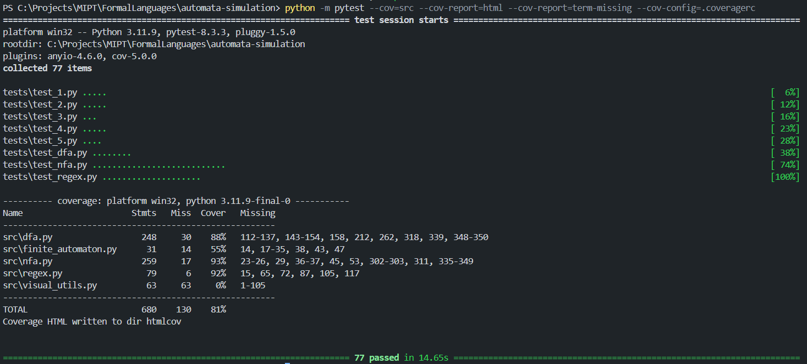

# Формалки

## Прохождение тестов




## Основные операции

1. Класс NFA (НКА):
   - Создание от строки: `NFA.from_string("States: 0 1\nAlphabet: a b\nStart: 0\nAccept: 1\n0 -> a -> 1")`
   - Распознавание слов: `nfa.simulate("ab")`
   - Вывод текстового представления: `print(nfa)`

2. Класс DFA (ДКА):
   - Все методы NFA
   - Создание из NFA: `DFA.from_nfa(nfa)`

3. Минимизация DFA:
   - Метод `dfa.minimize()`

4. Создание автоматов от регулярного выражения:
   - NFA: `NFA.from_regex(RegularExpression("a(b|c)*"))`
   - DFA: `DFA.from_regex(RegularExpression("a(b|c)*"))`

5. Построение регулярного выражения по автомату:
   - NFA: `nfa.to_regex()`
   - DFA: `dfa.to_regex()`

### Формат строки для NFA/DFA

Строковое представление NFA/DFA должно иметь следующий формат:

```
States: <список состояний, разделенных пробелами>
Alphabet: <список символов алфавита, разделенных пробелами>
Start: <начальное состояние>
Accept: <список принимающих состояний, разделенных пробелами>
<переходы в формате: текущее_состояние -> символ -> следующее_состояние(я)>
```

Пример для NFA:

```
States: 0 1 2
Alphabet: a b
Start: 0
Accept: 2
0 -> a -> 1
1 -> b -> 1,2
1 -> a -> 2
```

Пример для DFA:

```
States: 0 1 2
Alphabet: a b
Start: 0
Accept: 2
0 -> a -> 1
0 -> b -> 0
1 -> a -> 2
1 -> b -> 1
2 -> a -> 2
2 -> b -> 2
```

Примечание: Для NFA допускаются множественные переходы и eps-переходы (обозначаются пустой строкой).
